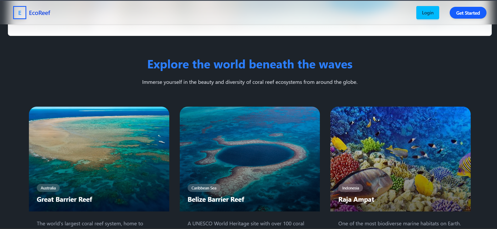
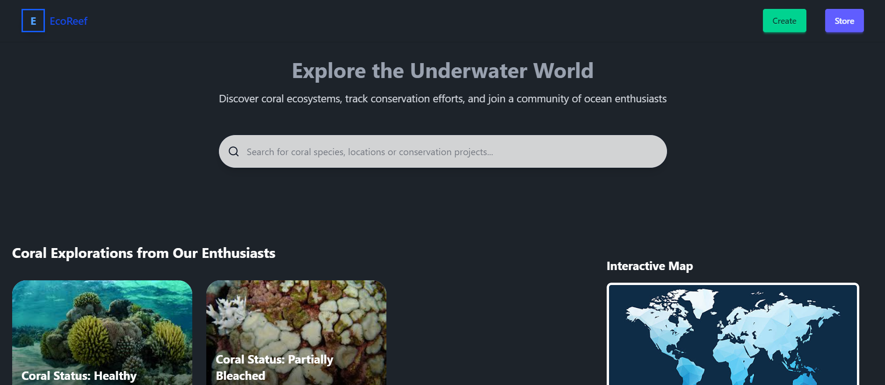
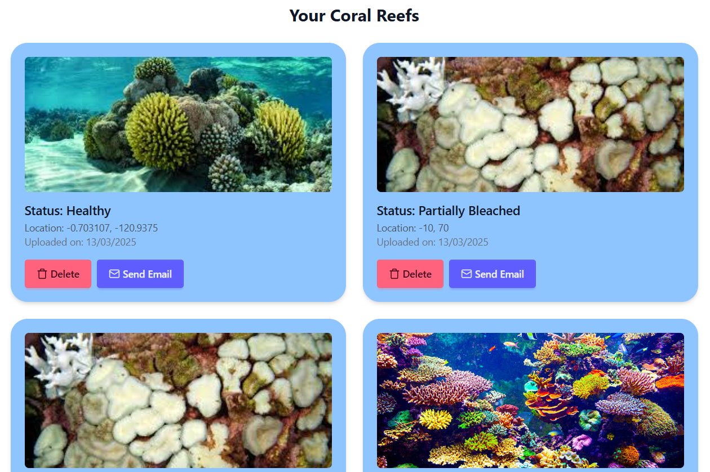
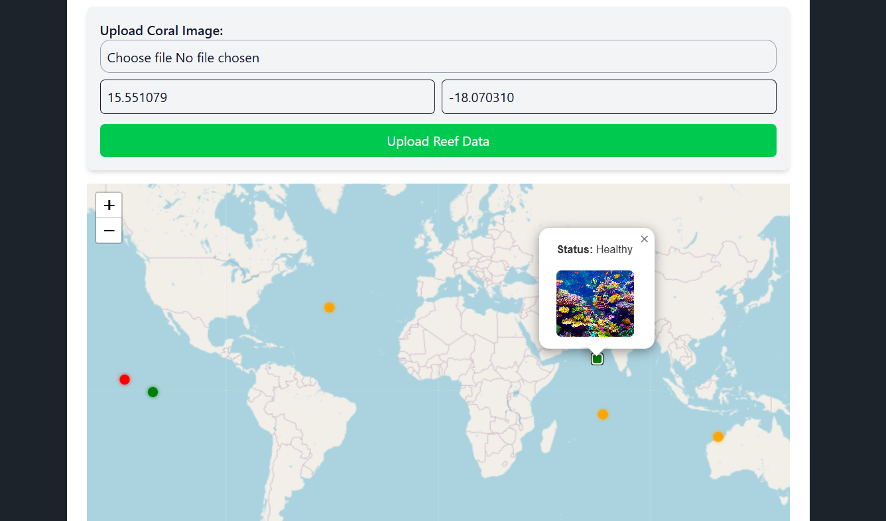

# **EcoReef 🌊 | A Sustainable Coral Reef Monitoring System**  
**Hackathon Project | Sustainable Development - Life Under Water**  

🔗 **GitHub Repo:** [EcoReef](https://github.com/MUKILAN019/EcoReef)  
📌 **Tech Stack:** React, Django, TailwindCSS, PostgreSQL, OpenCV

---

## **🌟 Overview**  
**EcoReef** is a project designed to monitor and protect **coral reefs** using modern web technology. The platform provides insights into coral reef health, tracks changes over time, and suggests solutions for sustainability.  

**Key Focus Areas:**  
✅ **Reef Monitoring** – Track coral conditions with real-time updates.  
✅ **Data Visualization** – Represent environmental changes clearly.  
✅ **Community Involvement** – Enable users to report reef conditions.  

---

## **🚀 Features**  
🔹 **Live Coral Reef Health Monitoring** – Tracks water quality, temperature, and pollution levels.  
🔹 **Reef Data Dashboard** – Graphical analysis for environmental tracking.  
🔹 **User Reports & Alerts** – Allows users to report environmental threats.  
🔹 **Offline PWA Integration (Upcoming)** – Plan to make it work even in **low-internet** areas.  

---

## **🛠 Tech Stack & Tools**  
| Technology | Usage |  
|------------|----------------|  
| **React.js** | Frontend development |  
| **Django (Python)** | Backend API |  
| **PostgreSQL** | Database for data storage |  
| **TailwindCSS** | UI Styling |  
| **DaisyUI** | Pre-built UI components |  

---

## **📷 Screenshots (Add These!)**  




---

## **💻 Installation & Setup**  
### **1️⃣ Clone the repository:**  
```bash
git clone https://github.com/MUKILAN019/EcoReef.git
cd EcoReef
```

### **2️⃣ Backend Setup (Django - Server)**  
```bash
cd server
pip install -r requirements.txt
python manage.py migrate
python manage.py runserver
```

### **3️⃣ Frontend Setup (React - Client)**  
```bash
cd client
npm install
npm run dev
```

🔹 **Your app should now be running on `http://localhost:5173`!**  

---

## **🌍 Real-World Applications & Improvements**  
🔹 **How will it work underwater?** – The system can be enhanced with **IoT sensors** to gather real-time data.  
🔹 **How will it work offline?** – Future improvements will integrate **Progressive Web Apps (PWA)** to allow offline functionality.  

---

## **📬 Contact & Contributions**  
🛠 **Developed by:** [Mukilan](https://github.com/MUKILAN019)  
💡 **Contributions Welcome!** Feel free to raise issues or create pull requests.  

---


